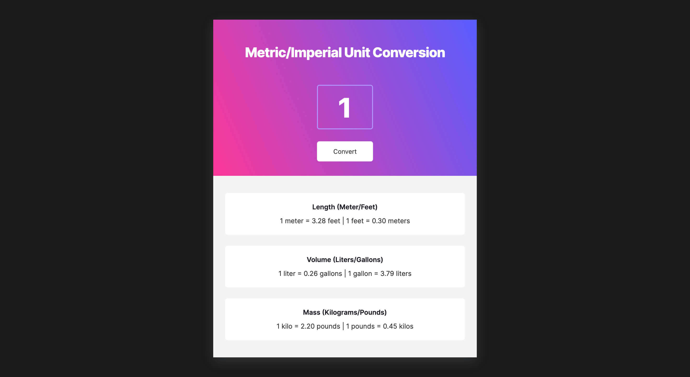

# Unit Converter

This is a project of the [Scrimba](https://scrimba.com) Frontend Career Path.

## About The Project

The project aims to convert mass, length, and volume  metric units to imperial units.

Live site: https://unit-converter-by-alph-fonti.netlify.app

## Built with

- [FontAwesome](https://fontawesome.com/)
- [Clipboard API](https://developer.mozilla.org/en-US/docs/Web/API/Clipboard_API)
- [Math built-in object](https://developer.mozilla.org/en-US/docs/Web/JavaScript/Reference/Global_Objects/Math)

## Acknowledgments

- [Scrimba](https://scrimba.com)